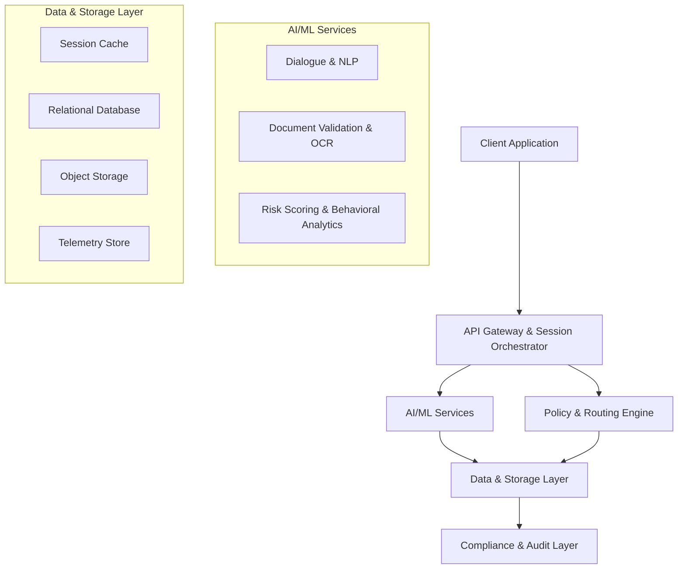
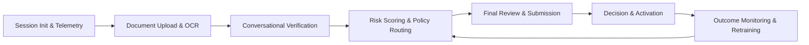

# Conversational KYC Engine: Adaptive Verification Platform

## Summary

Traditional KYC onboarding relies on static, multi-step forms that consistently produce high abandonment rates, increase customer acquisition costs, and strain compliance operations. This project proposes a conversational verification platform that replaces rigid forms with a guided, messaging-style interface. The system extracts data from uploaded identification documents, validates capture quality in real time, and conducts a structured dialogue to confirm information, collect missing fields, and address user concerns. Behavioral signals and document metrics are continuously evaluated by a risk-scoring model, enabling adaptive verification paths that fast-track low-risk applicants while escalating anomalies for review. The result is a compliant, conversion-optimized onboarding workflow that reduces operational overhead and accelerates account activation.

## Core Features

- Conversational onboarding interface with structured, compliance-safe dialogue
- Real-time document quality validation and automated field extraction
- Behavioral interaction tracking (response latency, hesitation, correction patterns)
- Adaptive risk routing with tiered verification requirements
- Consolidated review interface for final user validation and editing
- Immutable audit logging and regulator-ready decision trails
- Continuous monitoring pipeline for model drift and outcome-based retraining

## Advantages

### Business Impact

- Recovers 20 to 30 percent of abandoned onboarding flows by removing unnecessary friction
- Reduces KYC-related support volume by approximately 50 percent through proactive guidance
- Lowers customer acquisition costs by accelerating time-to-first-transaction
- Maintains strict regulatory alignment with transparent, policy-enforced routing

### Technical Strengths

- Sub-500 millisecond inference latency with modular, horizontally scalable services
- Deterministic fallbacks for compliance-critical steps; AI handles guidance and flow orchestration
- MLOps-ready architecture with feature versioning, experiment tracking, and automated retraining
- Vendor-agnostic design allowing seamless substitution of OCR, LLM, or bureau providers

## Known Limitations & Future Iterations

- **LLM Latency and Cost at Scale:** Hosted 7B to 8B models introduce variable inference costs. Version 2 will implement distilled edge models, response caching, and hybrid deterministic routing to reduce compute overhead.
- **Cold-Start Risk Calibration:** Early scoring relies on limited historical telemetry. Version 2 will incorporate cross-institution anonymized signals and expanded bureau integrations to improve baseline accuracy.
- **Regional Document and Language Coverage:** Initial OCR and dialogue guardrails target primary government IDs and dominant languages. Version 2 will add locale-specific training data and multilingual NLP pipelines.
- **Low-Bandwidth Performance:** Real-time media validation assumes stable connectivity. Version 2 will introduce client-side preprocessing, progressive uploads, and offline queueing for emerging market resilience.

## Architecture Overview

The architecture follows a stateful session model with strict separation between conversational guidance, risk computation, and compliance enforcement. Critical verification steps use deterministic policy routing. AI components handle user guidance, objection resolution, and adaptive flow orchestration.

## Data Flow & Structure

1. **Session Initialization:** Device fingerprint, network metadata, and baseline telemetry are captured and stored in a session cache and telemetry store.
2. **Document Processing:** Uploaded identification media undergoes quality validation. OCR extracts structured fields into a versioned JSON payload.
3. **Conversational Verification:** The dialogue engine confirms extracted data, requests missing attributes, and logs interaction patterns. Behavioral features are pushed to the feature store.
4. **Risk Scoring & Routing:** A calibrated model computes a real-time risk percentile. The policy engine maps the score to a verification tier, triggering step-down or escalation paths.
5. **Final Review & Submission:** Users validate or edit a consolidated form. The payload is committed to the relational database with tamper-evident audit logs.
6. **Decision & Activation:** Final scoring and compliance checks determine instant activation, manual review, or compliant rejection.
7. **Feedback Loop:** Post-activation outcomes are labeled. Drift metrics and conversion rates trigger scheduled model retraining and threshold adjustments.

**Data Structure:** Event-sourced telemetry, versioned feature sets, encrypted PII with field-level tokenization, and immutable decision logs. Retention policies enforce regulatory data lifecycle requirements.

## Project Plan

| Phase | Timeline | Deliverables | Success Metrics |
| --- | --- | --- | --- |
| 1. Core MVP | Weeks 1 to 3 | Chat interface, document upload, OCR extraction, static routing, review form | Under 2 second document processing, 90 percent field extraction accuracy |
| 2. AI & Risk Engine | Weeks 4 to 6 | Guardrailed dialogue, behavioral tracking, risk scorer, policy routing | 30 percent drop-off reduction, under 500 millisecond inference latency |
| 3. Compliance & MLOps | Weeks 7 to 9 | Audit logging, drift monitoring, retraining pipeline, security hardening | 100 percent regulator-ready logs, under 5 percent monthly model drift |
| 4. Pilot & Rollout | Weeks 10 to 12 | A/B testing, bureau integrations, latency tuning, monitoring dashboards | 20 to 30 percent flow recovery, 40 percent support ticket reduction |

## Minimal Tech Stack (Provisional)

*Note: Selections represent a lean MVP baseline. Components may be substituted based on vendor agreements, regional compliance requirements, or infrastructure constraints.*

- **Client:** React / React-Native / Flutter, TypeScript / JSX, WebSocket client
- **Backend & Orchestration:** FastAPI, Redis, Celery, PostgreSQL
- **AI & ML:** \*Hosted 7B LLM (Bedrock/Vertex), LangChain with output guardrails, OpenCV/MediaPipe, \*AWS Textract or \*Google Document AI, \*LightGBM/XGBoost
- **Data & Telemetry:** \*Feast (feature store), MLflow (experiment tracking), \*ClickHouse (event telemetry), S3/MinIO (encrypted media)
- **Policy & Security:** OpenPolicyAgent, HashiCorp Vault, KMS encryption, Loki/ELK (audit logging)
- **DevOps & Monitoring:** Docker, Kubernetes or Cloud Run, GitHub Actions, \*Terraform, \*Prometheus/Grafana, \*Evidently AI (drift monitoring)

## Contact

Please contact the owner for further details.
